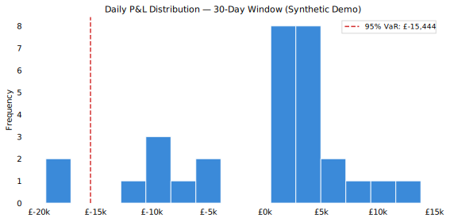
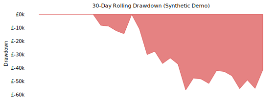
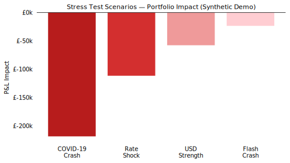
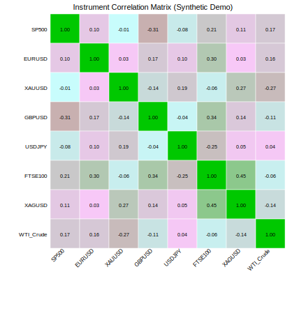

# Risk Analysis Toolkit

**Portfolio risk metrics, VaR, stress testing and correlation analysis | Python · pandas · NumPy · matplotlib**

> **Dataset:** All data is entirely synthetic and used for portfolio demonstration purposes only. It does not represent real positions, live market data, or financial advice.

---

## Overview

This toolkit performs quantitative risk analysis on a simulated **£2,000,000 multi-asset portfolio** spanning FX, equities and commodities. It computes industry-standard risk metrics, applies historical-simulation Value at Risk (VaR), runs pre-defined stress scenarios, and produces professional risk reporting outputs.

Demonstrates practical skills in:
- Portfolio risk metric calculation (VaR, CVaR, Sharpe, Sortino, drawdown)
- Historical simulation methodology
- Stress testing and scenario analysis
- Cross-asset correlation analysis
- Structured risk reporting with logging and validation

---

## Target Use Case

| Role | Relevance |
|---|---|
| Risk Analyst | VaR, CVaR, drawdown, stress testing |
| Trading Analyst | Portfolio exposure, P&L attribution, scenario analysis |
| Quantitative Analyst | Statistical risk metrics, correlation, return distribution |
| Financial Analyst | Exposure reporting, portfolio-level KPIs |

---

## Portfolio Overview (Synthetic Demo)

| Instrument | Asset Class | Direction | Notional (£) | Weight |
|---|---|---|---|---|
| SP500 | Equities | Long | £480,000 | 24.0% |
| EURUSD | FX | Long | £380,000 | 19.0% |
| XAUUSD | Commodities | Long | £350,000 | 17.5% |
| GBPUSD | FX | **Short** | £220,000 | 11.0% |
| USDJPY | FX | Long | £180,000 | 9.0% |
| FTSE100 | Equities | Long | £160,000 | 8.0% |
| XAGUSD | Commodities | Long | £120,000 | 6.0% |
| WTI_Crude | Commodities | Long | £110,000 | 5.5% |
| **Total** | | | **£2,000,000** | |

**Gross long exposure:** £1,780,000 (89%) | **Gross short:** £220,000 (11%) | **Net long:** £1,560,000 (78%)

---

## Key Risk Metrics

Metrics are computed and printed by `python src/risk_analysis.py`:

| Metric | Method |
|---|---|
| 1-Day VaR (95% & 99%) | Historical simulation |
| CVaR / Expected Shortfall | Tail-mean beyond VaR threshold |
| Annualised Volatility | Daily std × √252 |
| Max Drawdown (£ and %) | Rolling peak-to-trough |
| Annualised Sharpe Ratio | Ann. return / ann. volatility |
| Sortino Ratio | Ann. return / downside deviation |

---

## Stress Test Results (Analytically Computed)

| Scenario | Portfolio P&L | Return | Severity |
|---|---|---|---|
| COVID-19 Parallel (Mar 2020) | −£218,600 | −10.9% | Critical |
| Rate Shock Parallel (2022) | −£111,600 | −5.6% | Severe |
| USD Strength Shock | −£57,700 | −2.9% | Moderate |
| Flash Crash / Risk-Off Spike | −£23,500 | −1.2% | Low |

---

## Outputs / Screenshots

> All charts are generated by running `python src/risk_analysis.py` against the synthetic dataset.

### Daily P&L Distribution with 95% VaR


### 30-Day Rolling Drawdown


### Stress Test Scenarios


### Portfolio Exposure by Instrument


### Instrument Correlation Matrix


---

## Methodology

1. **Load & validate** portfolio positions and daily instrument returns
2. **Compute portfolio daily P&L** using signed notional weights (positive = long, negative = short)
3. **Historical-simulation VaR** — rank observed daily P&L, read percentile thresholds
4. **CVaR** — average of all P&L observations below the VaR threshold
5. **Stress scenarios** — apply instantaneous instrument shocks, compute portfolio P&L impact
6. **Correlation matrix** — Pearson correlations across all instruments
7. **Drawdown series** — rolling peak-minus-current equity
8. **Charts & exports** — five SVG charts, two CSV outputs

---

## How to Run

```bash
git clone https://github.com/frazwil19-gif/risk-analysis-toolkit.git
cd risk-analysis-toolkit
python -m venv venv
source venv/bin/activate   # Windows: venv\Scripts\activate
pip install -r requirements.txt
python src/risk_analysis.py
```

---

## Folder Structure

```text
risk-analysis-toolkit/
├── README.md
├── requirements.txt
├── .gitignore
├── data/
│   ├── raw/
│   │   ├── portfolio_positions.csv
│   │   └── instrument_returns.csv
│   └── processed/
├── src/
│   └── risk_analysis.py
├── notebooks/
└── reports/
    ├── charts/
    │   ├── pnl_distribution.svg
    │   ├── drawdown.svg
    │   ├── correlation_matrix.svg
    │   ├── stress_scenarios.svg
    │   └── exposure_breakdown.svg
    ├── risk_metrics.csv
    ├── stress_scenarios.csv
    └── risk_summary_report.md
```

---

## Limitations

- Return data covers **30 synthetic trading days** — statistically insufficient for robust VaR (252+ days recommended in practice)
- Stress scenarios apply instantaneous shocks without path dependency or liquidity effects
- No intraday risk, overnight gap risk, or margin requirements modelled
- Tail correlations in stress events typically exceed normal-period Pearson correlations

---

## Disclaimer

This project is for portfolio and educational purposes only. It does not constitute financial advice or represent real investment performance.
