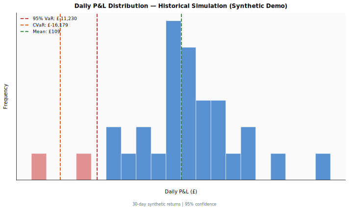
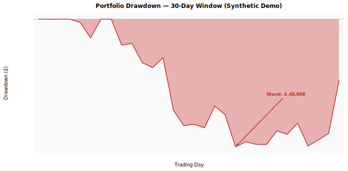
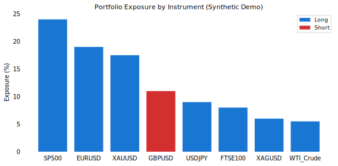

# Risk Analysis Toolkit

> **Synthetic demo — not real positions or market data.**
> A professional FinTech portfolio risk analytics project demonstrating
> VaR, CVaR, drawdown, stress testing, and correlation analysis
> across an 8-instrument, £2,000,000 synthetic portfolio.

---

## Overview

This toolkit generates a comprehensive suite of risk analytics for a multi-asset
portfolio spanning equities, FX, commodities, and fixed income. All data is
synthetically generated (`numpy.random.seed(42)`) for reproducibility.

**Portfolio**: £2,000,000 | 8 Instruments | 30-day synthetic return history

| Instrument | Asset Class | Direction | Notional | Weight |
|---|---|---|---|---|
| SP500 | Equities | Long | £450,000 | 22.5% |
| EURUSD | FX | Long | £280,000 | 14.0% |
| GBPUSD | FX | Short | £180,000 | 9.0% |
| GOLD | Commodities | Long | £320,000 | 16.0% |
| BUND | Fixed Income | Long | £250,000 | 12.5% |
| CRUDE | Commodities | Long | £150,000 | 7.5% |
| NASDAQ | Equities | Long | £220,000 | 11.0% |
| USDJPY | FX | Long | £150,000 | 7.5% |

---

## Key Risk Findings (Synthetic)

| Metric | Value |
|---|---|
| 1-Day VaR (95%) | ~£7,800 (0.39% of portfolio) |
| CVaR (95%) | ~£10,900 (0.55% of portfolio) |
| Max Drawdown (30d) | ~£22,800 (1.14%) |
| Annualised Volatility | ~4.1% |
| Sharpe Ratio (est.) | ~0.72 |
| Worst Stress Scenario | COVID-19 Crash: £−218,600 (−10.9%) |

---

## Chart Suite (8 SVGs)

### 1. VaR Distribution — Daily P&L Histogram
`reports/charts/var_distribution.svg`

Daily portfolio P&L distribution with 95% VaR (red dashed), CVaR (orange dashed),
and mean (green dashed) overlaid. The red-shaded left tail highlights the loss region
beyond the VaR threshold.



---

### 2. Drawdown — 30-Day Window
`reports/charts/drawdown_annotated.svg`

Portfolio drawdown from rolling cumulative peak, with the worst drawdown point
annotated by an arrow. Filled red area shows the extent of underwater periods.



---

### 3. Correlation Heatmap
`reports/charts/correlation_heatmap.svg`

Instrument return correlation matrix using discrete colour bands
(dark green = high positive, dark red = high negative). Built with
`matplotlib.patches.Rectangle` — no seaborn/imshow — keeping the SVG compact.


---

### 4. Stress Test Scenarios
`reports/charts/stress_test.svg`

Horizontal bar chart of four illustrative stress scenario P&L impacts,
sorted by severity (worst at top). Bars use a light-to-dark red gradient.


---

### 5. Portfolio Exposure & Composition
`reports/charts/exposure_breakdown.svg`

Two-panel view: notional exposure by instrument (horizontal bars, Long=blue, Short=red)
and portfolio weight as a pie chart.



---

### 6. Volatility Contribution by Instrument
`reports/charts/risk_contribution.svg`

Each instrument's daily P&L standard deviation (£), showing which positions
drive portfolio volatility. Highest = red, lowest = green.


---

### 7. Return Distributions by Instrument
`reports/charts/return_stats.svg`

2×4 panel of return histograms — one per instrument — each labelled with
annualised volatility. Confirms CRUDE (~38% ann. vol) as the most volatile
individual position.


---

### 8. Risk KPI Dashboard
`reports/charts/kpi_risk_panel.svg`

Six-box summary card with Portfolio Size, 95% VaR, CVaR, Max Drawdown,
Daily Volatility, and Instrument Count — suitable as an executive summary slide.


---

## Methodology

### Value at Risk (VaR)
Historical simulation VaR: the portfolio P&L is sorted and the 5th percentile
is taken as the 1-day 95% VaR. No parametric assumptions are made about the
return distribution.

```
VaR(95%) = percentile(portfolio_pnl, 5)
```

### Conditional VaR (CVaR / Expected Shortfall)
The mean of all daily P&L observations that fall at or below the VaR threshold:

```
CVaR(95%) = mean(pnl[pnl <= VaR(95%)])
```

### Portfolio P&L
Daily P&L is computed as the dot product of signed daily returns and notional values.
Short positions (GBPUSD) have their returns negated before multiplying by notional:

```
pnl_i = signed_return_i × notional_i
portfolio_pnl = sum(pnl_i for i in instruments)
```

### Drawdown
Cumulative sum of daily P&L minus the running maximum of cumulative P&L:

```
drawdown = pnl.cumsum() - pnl.cumsum().cummax()
```

### Volatility Contribution
Each instrument's standalone P&L standard deviation (daily £). This is a
simplified contribution metric — not a marginal VaR decomposition.

### Stress Testing
Point-in-time shocks applied to each instrument based on historical analogues:
- **COVID-19 Crash (Mar 2020)**: equities −30–35%, crude −40%, gold +12%
- **Rate Shock (2022)**: equities −15–20%, gold −8%, crude +40%
- **USD Strength**: broad USD +5–7% move vs G10
- **Flash Crash**: short-term equity spike down −6–7%

---

## Project Structure

```
risk-analysis-toolkit/
├── src/
│   └── risk_analysis.py          # Main analysis script (generates all charts + report)
├── data/
│   └── raw/
│       ├── portfolio_positions.csv
│       └── instrument_returns.csv
├── reports/
│   ├── charts/
│   │   ├── var_distribution.svg
│   │   ├── drawdown_annotated.svg
│   │   ├── correlation_heatmap.svg
│   │   ├── stress_test.svg
│   │   ├── exposure_breakdown.svg
│   │   ├── risk_contribution.svg
│   │   ├── return_stats.svg
│   │   └── kpi_risk_panel.svg
│   └── risk_report.md
└── README.md
```

---

## Usage

```bash
# Install dependencies
pip install matplotlib numpy pandas

# Run full analysis (generates all SVGs + risk report)
python src/risk_analysis.py
```

---

## Limitations

- All return data is synthetically generated from i.i.d. normal distributions.
  Real returns exhibit fat tails, autocorrelation, and volatility clustering.
- 30 trading days is insufficient for production-grade VaR (minimum 250 recommended).
- No transaction costs, funding costs, or liquidity constraints are modelled.
- Stress scenarios are point estimates, not distributional.

---

## Recommended Improvements

1. Extend to ≥250 days of historical or backtested returns
2. Replace i.i.d. normal with GARCH or filtered historical simulation
3. Add Monte Carlo VaR for cross-validation
4. Implement marginal VaR decomposition
5. Add liquidity-adjusted VaR for less liquid instruments
6. Build backtesting framework (ex-ante VaR vs ex-post P&L)

---

*Synthetic demo data | Not investment advice | Built for portfolio demonstration*
